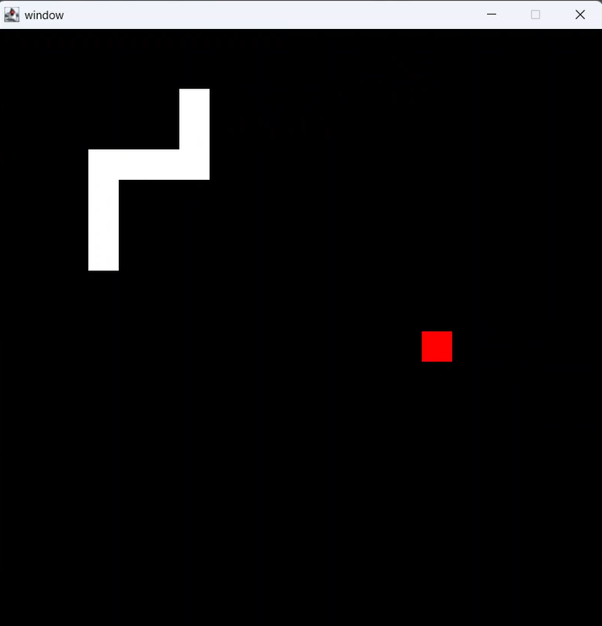

# Pixel Snake Game

A simple pixel-style Snake game made in **Java**.  
The player controls a snake that grows longer when eating food.  
The goal is to survive as long as possible without hitting the walls or yourself.

## Screenshots

## Features
- Classic Snake gameplay  
- Pixel graphics  
- Written fully in Java  

